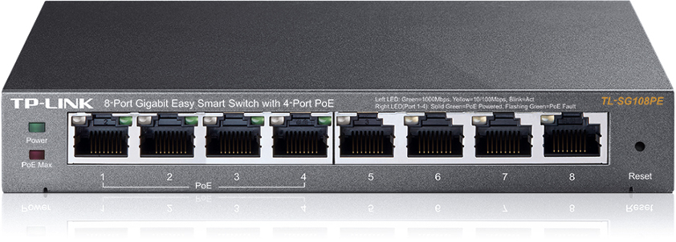

====================================================
Library to control network switch tp-link TL-SG108PE
====================================================

|

:Author: marcinooo
:Tags: Python, Selenium, tp-link, switch, TL-SG108PE, Library

:abstract:

   Library to control switch via admin page.

.. contents ::

Description
===========

Switch tp-link TL-SG108PE:

Above switch can be control from Python code. It implements methods to manage main switch settings.
Methods are divided in sections:

- System:
    - ``system_info()``
    - ``set_device_description(description)``
    - ``ip_settings()``
    - ``enable_dhcp_configuration()``
    - ``disable_dhcp_configuration()``
    - ``set_ip(ip_address, subnet_mask, default_gateway)``
    - ``led_on()``
    - ``led_off()``
    - ``user_account()``
    - ``set_user_account_details(username, current_password, new_password, confirm_password)``
- Switching:
    - ``ports_settings()``
    - ``set_port_settings(self, port, status, speed, flow_control)``
    - ``igmp_snooping()``
    - ``enable_igmp_snooping()``
    - ``disable_igmp_snooping()``
    - ``enable_report_message_suppression()``
    - ``disable_report_message_suppression()``
    - ``lag_settings()``
    - ``set_lag_ports(lag_id, ports)``
    - ``unset_lag_ports(lag_id)``
- Monitoring:
    - ``port_statistics(refresh)``
    - ``refresh_port_statistics()``
    - ``mirrored_ports()``
    - ``mirroring_port()``
    - ``enable_port_mirroring(mirrored_ports, mirroring_port, ingress, egress)``
    - ``disable_port_mirroring()``
    - ``loop_prevention()``
    - ``enable_loop_prevention()``
    - ``disable_loop_prevention()``
- VLAN:
    - ``mtu_vlan_configuration()``
    - ``enable_mtu_vlan_configuration()``
    - ``disable_mtu_vlan_configuration()``
    - ``change_mtu_vlan_uplink_port(port)``
    - ``port_based_vlan_configuration()``
    - ``enable_port_based_vlan_configuration()``
    - ``disable_port_based_vlan_configuration()``
    - ``add_port_based_vlan(vlan_id, ports)``
    - ``remove_port_based_vlan(vlan_id)``
    - ``ieee_802_1q_vlan_configuration()``
    - ``enable_ieee_802_1q_vlan_configuration()``
    - ``disable_ieee_802_1q_vlan_configuration()``
    - ``add_ieee_802_1q_vlan(vlan_id, ports, vlan_name)``
    - ``remove_ieee_802_1q_vlan(vlan_id)``

Documentation
-------------

Documentation can be found under: <url - soon>

Usage
=====

An example of using the library to create port based VLAN.

Before running script install library. Next set environment variables in console via commands:

``$ export ADMIN_IP=<switch ip>``

``$ export ADMIN_USERNAME=<admin username>``

``$ export ADMIN_PASSWORD=<admin password>``

.. code:: python

    from switch_TL_SG108PE.switch_manager import SwitchManager

    switch_manager = SwitchManager()
    switch_manager.connect(os.environ['ADMIN_IP'],
                           os.environ['ADMIN_USERNAME'],
                           os.environ['ADMIN_PASSWORD'])
    vlan = self.switch_manager.control('VLAN')
    vlan.add_port_based_vlan(vlan_id=1, ports=[2, 3, 4])
    van_configuration = vlan.port_based_vlan_configuration()
    print(van_configuration)

More examples can be found in documentation :wink:.

Installation
============

Install from PyPI:

``$ pip install switch_TL_SG108PE``

Install from github:

``$ pip install git+https://github.com/marcinooo/switch_TL_SG108PE``

License
=======

license_ (MIT)

.. _license: https://github.com/marcinooo/switch_TL_SG108PE/blob/main/LICENSE.txt