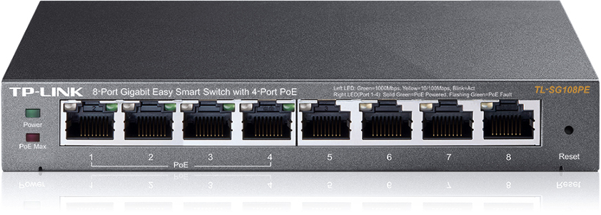

.. switch_TL_SG108PE documentation master file, created by
   sphinx-quickstart on Sun Jan 15 12:24:40 2023.
   You can adapt this file completely to your liking, but it should at least
   contain the root `toctree` directive.

========================================
Network switch tp-link TL-SG108PE client
========================================

.. image:: https://circleci.com/gh/marcinooo/switch_TL_SG108PE/tree/main.svg?style=svg
    :target: https://circleci.com/gh/marcinooo/switch_TL_SG108PE/?branch=main

|

:Author: marcinooo
:Tags: Python, Selenium, tp-link, switch, TL-SG108PE, Library

Description
===========

What can I say? This is a python library to control the tp-link TL-SG108PE switch:

**Details**

.. list-table::

   * - Firmware Version
     - 1.0.0 Build 20200415 Rel.54962
   * - Hardware Version
     - TL-SG108PE 3.0

We install the library on our computer and control the switch
which is in the same network.

.. toctree::
   :glob:
   :hidden:

   self

.. toctree::
   :glob:
   :titlesonly:
   :caption: USER GUIDE

   installation
   usage
   examples
   license

.. toctree::
   :glob:
   :maxdepth: 2
   :titlesonly:
   :caption: DEVELOPER GUIDE

   modules

Indices and tables
==================

* :ref:`genindex`
* :ref:`modindex`
* :ref:`search`
