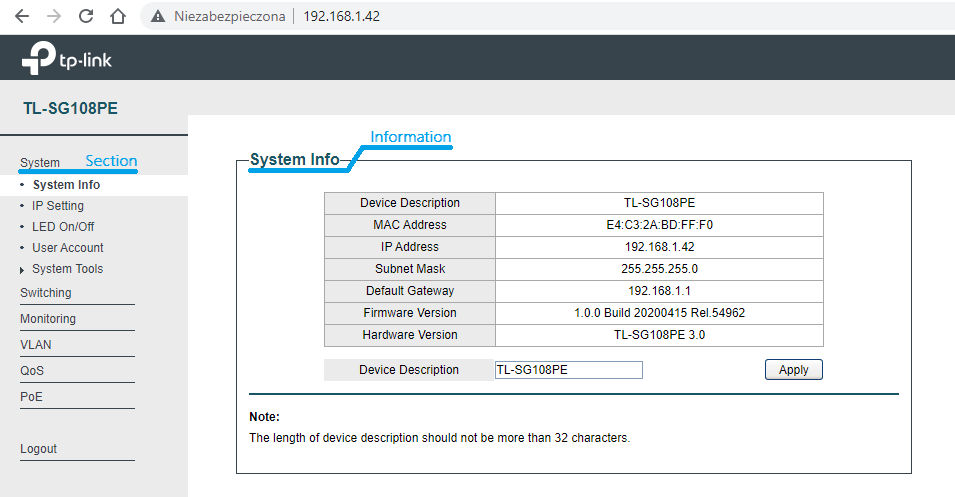

Usage
=====

Let's consider an example:

.. literalinclude :: ../../examples/01_get_system_information.py
   :language: python

As we can see in the example, the main package is ``switch_TL_SG108PE``.
It provides the ``SwitchManager()`` class that is a client for managing the switch via a website.
The first step is to connect switch_manager to the switch using the ``connect()`` method.
Then we select the section to manage. In our case it is the *system* section.
The vlan object provides methods that allow us to perform selected actions on the switch.
After carrying out the action on the switch, switch_manager should be disconnected.

Results:

.. code::

   $ python 01_get_system_information.py
   {'Device Description': 'TL-SG108PE',
    'MAC Address': 'E4:C3:2A:BD:FF:F0',
    'IP Address': '192.168.1.42',
    'Subnet Mask': '255.255.255.0',
    'Default Gateway': '192.168.1.1',
    'Firmware Version': '1.0.0 Build 20200415 Rel.54962',
    'Hardware Version': 'TL-SG108PE 3.0'}

The above workflow is consistent with manually configuring the switch as shown in the image below:

In a similar way, we can control sections:

.. role:: python(code)
   :language: python

* system:
    * :python:`system_info() -> Dict[str, str]`
    * :python:`set_device_description(description: str) -> bool`
    * :python:`ip_settings() -> Dict[str, str]`
    * :python:`enable_dhcp_configuration() -> bool`
    * :python:`disable_dhcp_configuration() -> bool`
    * :python:`set_ip(ip_address: str, subnet_mask: str, default_gateway: str) -> bool`
    * :python:`led_on() -> bool`
    * :python:`led_off() -> bool`
    * :python:`user_account() -> Dict[str, str]`
    * :python:`set_user_account_details(username: str, current_password: str, new_password: str, confirm_password: str) -> bool`
* switching:
    * :python:`ports_settings() -> Dict[str, Dict[str, str]]`
    * :python:`set_port_settings(port: int, status: STATUS, speed: SPEED, flow_control: FLOW_CONTROL) -> bool`
    * :python:`igmp_snooping() -> Dict[str, str]`
    * :python:`enable_igmp_snooping() -> bool`
    * :python:`disable_igmp_snooping() -> bool`
    * :python:`enable_report_message_suppression() -> bool`
    * :python:`disable_report_message_suppression() -> bool`
    * :python:`lag_settings() -> Dict[str, str]`
    * :python:`set_lag_ports(lag_id: int, ports: List[int]) -> bool`
    * :python:`unset_lag_ports(lag_id: int) -> bool`
* monitoring:
    * :python:`port_statistics(refresh: bool = True) -> Dict[str, Dict[str, str]]`
    * :python:`refresh_port_statistics() -> bool`
    * :python:`mirrored_ports() -> Dict[str, Dict[str, str]]`
    * :python:`mirroring_port() -> Dict[str, str]`
    * :python:`enable_port_mirroring(mirrored_ports: List[int], mirroring_port: int, ingress: bool = True, egress: bool = True) -> bool`
    * :python:`disable_port_mirroring() -> bool`
    * :python:`loop_prevention() -> Dict[str, str]`
    * :python:`enable_loop_prevention() -> bool`
    * :python:`disable_loop_prevention() -> bool`
* VLAN:
    * :python:`mtu_vlan_configuration() -> Dict[str, str]`
    * :python:`enable_mtu_vlan_configuration() -> bool`
    * :python:`disable_mtu_vlan_configuration() -> bool`
    * :python:`change_mtu_vlan_uplink_port(port: int) -> bool`
    * :python:`port_based_vlan_configuration() -> Dict[str, Union[List[str], str]]`
    * :python:`enable_port_based_vlan_configuration() -> bool`
    * :python:`disable_port_based_vlan_configuration() -> bool`
    * :python:`add_port_based_vlan(vlan_id: int, ports: List[int]) -> bool`
    * :python:`remove_port_based_vlan(vlan_id: int) -> bool`
    * :python:`ieee_802_1q_vlan_configuration() -> Dict[str, str]`
    * :python:`enable_ieee_802_1q_vlan_configuration() -> bool`
    * :python:`disable_ieee_802_1q_vlan_configuration() -> bool`
    * :python:`add_ieee_802_1q_vlan(vlan_id: int, ports: List[IEEE8021QPort], vlan_name: str = '') -> bool`
    * :python:`remove_ieee_802_1q_vlan(vlan_id: int) -> bool`

